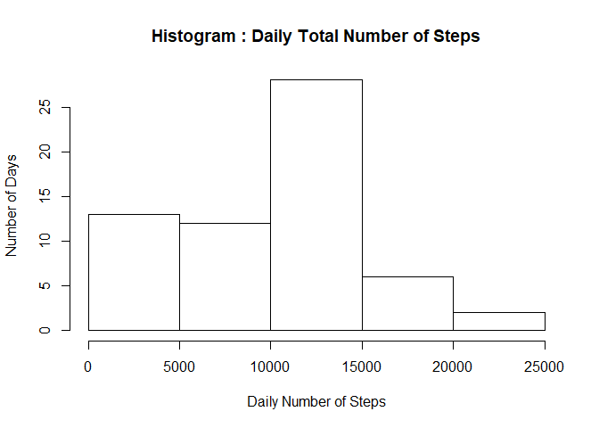
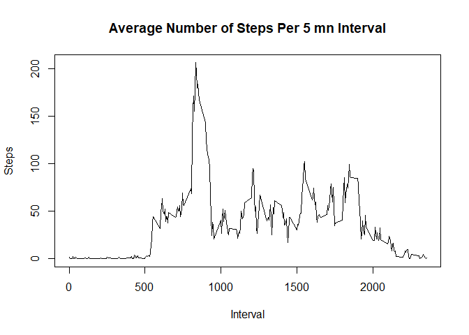
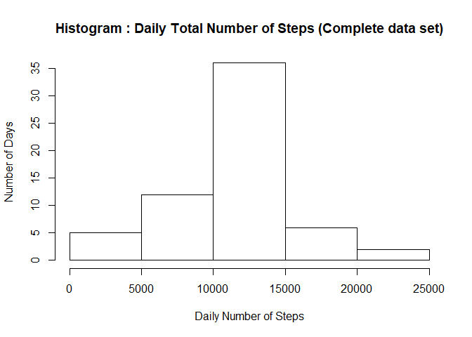
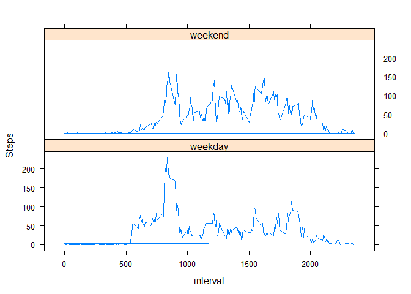

## Loading and preprocessing the data


```r
activity <- read.csv(unz("activity.zip","activity.csv"))
```

## What is mean total number of steps taken per day?


```r
dailysum <- tapply(activity$steps,activity$date,sum,na.rm = TRUE)
hist(dailysum,xlab="Daily Number of Steps", ylab="Number of Days", main = "Histogram : Daily Total Number of Steps"  )
```

<!-- -->

```r
meansteps <- round(mean(dailysum))
mediansteps<- round(median(dailysum))
```
The mean total number of steps taken per day = 9354 /
The median total number of steps taken per day = 10395 

## What is the average daily activity pattern?


```r
avgactpat <- tapply(activity$steps,activity$interval,mean,na.rm = TRUE)
plot(x=names(avgactpat), y=avgactpat,type="l",xlab="Interval",ylab="Steps", main="Average Number of Steps Per 5 mn Interval")
```

<!-- -->

```r
maxinterval <- names(which.max(avgactpat))
maxsteps <- round(max(avgactpat))
```
The maximum average number of steps 206 is reached on interval 835

## Imputing missing values

```r
nbmissvalues <- sum(is.na(activity$steps))
missintervals <- activity$interval[is.na(activity$steps)]
actcmp <- activity
j <- length(actcmp$steps)
i <- 1
for (i in 1:j){
    if (is.na(actcmp$steps[i])){
        actcmp$steps[i] <- avgactpat[toString(actcmp$interval[i])] 
        i<-i+1
    }
}
```
The total number of missing values is 2304
We used the mean for each 5-minute interval for filling in all of the missing values in the dataset


```r
dailysumcmp <- tapply(actcmp$steps,actcmp$date,sum)
hist(dailysumcmp,xlab="Daily Number of Steps", ylab="Number of Days", main = "Histogram : Daily Total Number of Steps (Complete data set)"  )
```

<!-- -->

```r
meanstepscmp <- round(mean(dailysumcmp),0)
medianstepscmp<- round(median(dailysumcmp),0)
```
For completed data, The mean total number of steps taken per day = 10766 /
The median total number of steps taken per day = 10766 
Both have increased compared to the original data mean = 9354 and median = 10395 and since the median of the completed data is equal the mean, the distribution became symetric which was not the case for the original data.
Imputing missing data has increased the average total daily number of steps.

## Are there differences in activity patterns between weekdays and weekends?


```r
library(lattice)
actcmp$weekend <- as.POSIXlt(as.Date(actcmp$date))$wday %in% c(0,6)
actcmp$weekend[actcmp$weekend == TRUE]<-"weekend"
actcmp$weekend[actcmp$weekend == FALSE]<-"weekday"
actcmp$weekend <- as.factor(actcmp$weekend)
actcmp$avgsteps[actcmp$weekend=="weekday"] <- tapply(actcmp$steps[actcmp$weekend=="weekday"],actcmp$interval[actcmp$weekend=="weekday"],mean)
actcmp$avgsteps[actcmp$weekend=="weekend"] <- tapply(actcmp$steps[actcmp$weekend=="weekend"],actcmp$interval[actcmp$weekend=="weekend"],mean)
xyplot(avgsteps~interval|weekend,data=actcmp,type="l",layout=c(1,2),ylab="Steps")
```

<!-- -->
